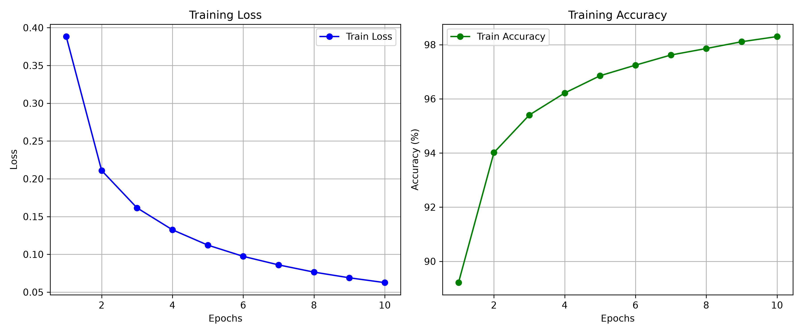
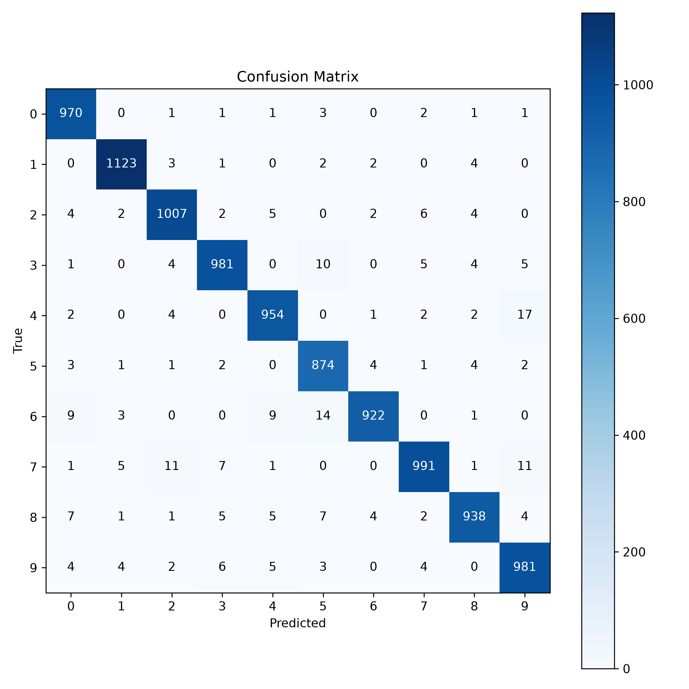

# MNIST MLP — Neural Network from Scratch (NumPy)

A fully from-scratch implementation of a multi-layer perceptron — forward
pass, backpropagation, and optimizers — built with raw NumPy, no autograd
frameworks. Trained on MNIST, achieving 97.41% test accuracy.

## Why from scratch?
Most ML projects use PyTorch/TensorFlow, which compute gradients automatically.
This project implements backpropagation manually to demonstrate a deep
understanding of the underlying math — verified numerically (see below) rather
than assumed correct because "the loss went down."

## Architecture
- Configurable `Sequential` model — any number of Dense+ReLU layers
- Softmax + Cross-Entropy output (combined gradient for numerical stability)
- Optimizers: SGD, Momentum, Adam (all implemented from scratch)
- L2 regularization

## Correctness verification
Backpropagation was verified against numerical gradients (central difference,
ε=1e-5) for every parameter:

| Parameter | Max relative error | Status |
|---|---|---|
| dense1.W | 5.33e-10 | PASS |
| dense1.b | 1.97e-08 | PASS |
| dense2.W | 8.56e-11 | PASS |
| dense2.b | 2.64e-08 | PASS |

Run it yourself: `python gradient_check.py`

## Results

| Model | Test Accuracy | Train Time |
|---|---|---|
| This implementation (NumPy, from scratch) | 97.41% | 107.08s |
| sklearn MLPClassifier (same architecture) | 97.69% | 84.62s |

## Per-class accuracy
| Digit | Acc % |
|-------|-------|
|   0   | 98.98 |
|   1   | 98.94 |
|   2   | 97.58 |
|   3   | 97.13 |
|   4   | 97.15 |
|   5   | 97.98 |
|   6   | 96.24 |
|   7   | 96.40 |
|   8   | 96.30 |
|   9   | 97.22 |

## Usage

Install:
    pip install -r requirements.txt

Train:
    python train.py --epochs 10 --hidden-dims 128 --lr 0.1 --l2 1e-4

Evaluate:
    python evaluate.py

Predict on random samples:
    python predict.py

Run tests:
    pytest -v

Verify gradients:
    python gradient_check.py

Benchmark against sklearn:
    python benchmark.py

## Project structure
    MLP/
    ├── src/
    │   ├── layers.py       # Dense layer (forward/backward)
    │   ├── activations.py  # ReLU, Softmax
    │   ├── losses.py       # CrossEntropy
    │   ├── optimizers.py   # SGD, Momentum, Adam
    │   ├── model.py        # Sequential container
    │   └── data.py         # MNIST loading, train/val split
    ├── tests/               # pytest unit tests
    ├── train.py
    ├── predict.py
    ├── evaluate.py
    ├── benchmark.py
    ├── gradient_check.py
    └── .github/workflows/   # CI (tests run automatically on push)

## What I learned
when i started this project i thought the hardest part would be the implementation of mathematical functions but surprisingly that was the easiest part becouse every layer just had a function and forward and backward relation to implement. the hard part of this project waas to connect all these layers to each other and test them alltogether to see if they even work right or not. before this project i saw backpropagation as a very complicated process to perform but as i wrote different parts of the code i realised its takes only a few lines to work. 
